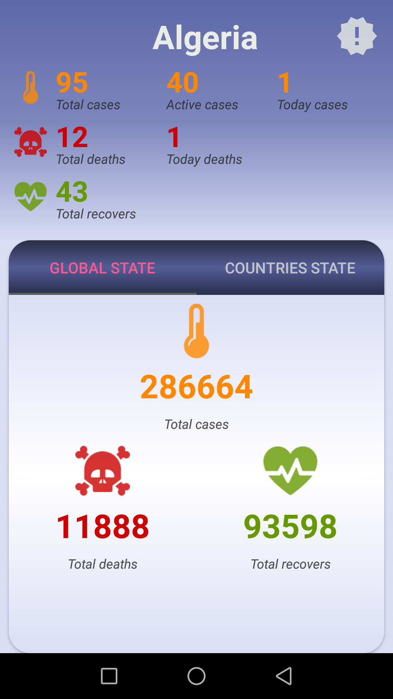
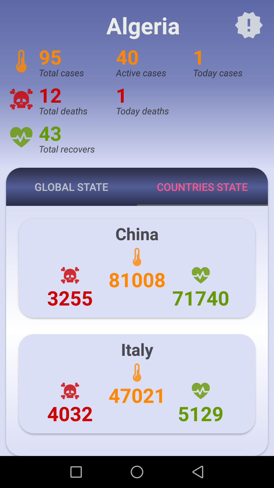
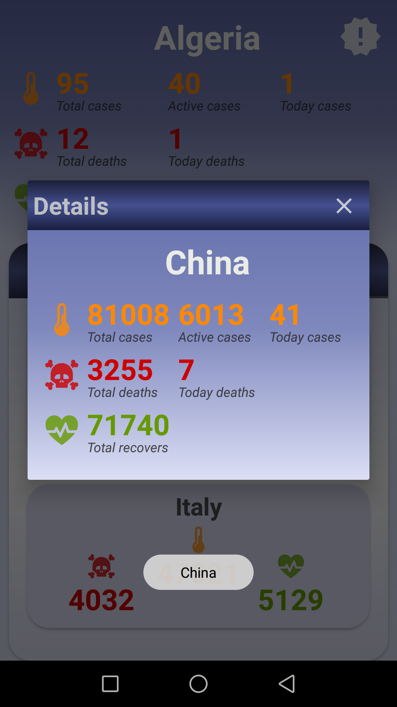
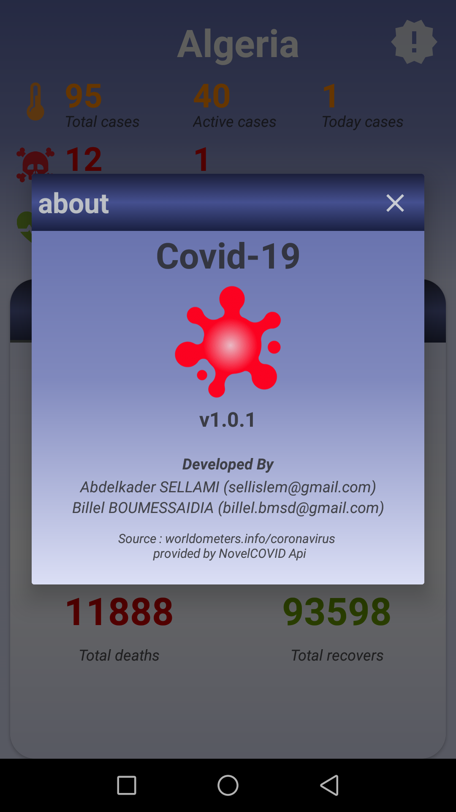

# Covid-19 Android App

Covid-19 is a mobile application that provides updated stats and data about the spreaded corona virus about the world.

Thanks to the reports and data provided by worldmeters.info/coronavirus and NovalCOVID API, the application simplifies and provide data about the spreading of the corona virus in the local region of the users, reports such as : how many active cases, new daily confirmed cases, new deaths and how many recovered one. 
The mobile application shows also, the total cases in the globe, and a detailed report about every country -sorted by the number of confirmed cases. 

## Screenshots

[](screenshots/screenshot1.png)
[](screenshots/screenshot2.png)
[](screenshots/screenshot3.png)
[](screenshots/screenshot4.png)


## Setup
Clone this repository and import into **Android Studio**
```bash
git clone https://github.com/islem19/CoronaCovid19.git
```

## Permissions
The App requires the following permissions:
- Internet access.

## Libraries and Dependencies
- [Retrofit](https://square.github.io/retrofit/)
- [CardView]()
- [Gson](https://github.com/google/gson)
- [Butterknife](https://jakewharton.github.io/butterknife/)
- [RecyclerView](https://developer.android.com/jetpack/androidx/releases/recyclerview)
- [Material Design](https://material.io/develop/android/components/)


## Maintainers
This project is mantained by:
* [Abdelkader SELLAMI](https://github.com/islem19)
* [Billel BOUMESSAIDIA](https://github.com/BillelBmsd)


## Contributing

1. Fork it
2. Create your feature branch (git checkout -b my-new-feature)
3. Commit your changes (git commit -m 'Add some feature')
4. Push your branch (git push origin my-new-feature)
5. Create a new Pull Request


## License
This application is released under GNU GPLv3 (see [LICENSE]()). Some of the used libraries are released under different licenses.